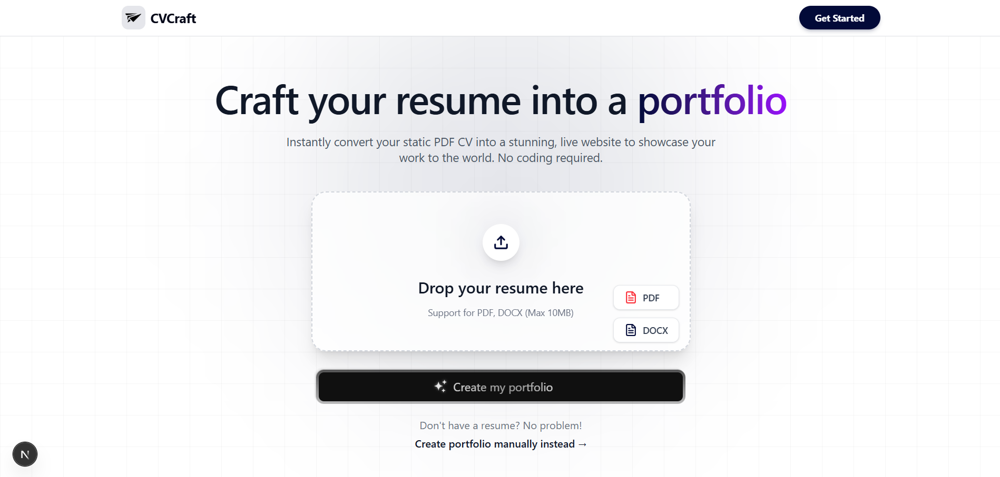

# 🚀 CVCraft - Modern Resume Builder

CVCraft is a high-performance, AI-powered resume builder designed to help professionals create stunning resumes in minutes. Built with the latest tech stack, it offers a seamless experience from parsing existing resumes to publishing them online.



## ✨ Features

- **🤖 AI-Powered Content Extraction**: Automatically parse PDF and DOCX files to extract your experience, education, and skills with high accuracy.
- **🎨 Professional Templates**: Choose from curated, high-impact designs including:
  - **Brutalist**: Bold, high-contrast, and modern.
  - **Maverick**: Professional, clean, and accent-rich.
  - **And more...**
- **⚡ Live Preview**: Real-time PDF-like preview of your resume as you edit details or swap templates.
- **🌐 Public Resume URLs**: One-click publishing to get a shareable, unique link (e.g., `cvcraft.com/p/your-slug`).
- **📂 User Dashboard**: Manage multiple resumes, track publish status, and edit with ease.
- **🌓 Dark Mode Support**: A beautiful, eye-friendly interface for the entire application.

## 🛠️ Tech Stack

- **Frontend**: [Next.js 15](https://nextjs.org/) (App Router), [React 19](https://react.dev/), [Tailwind CSS 4](https://tailwindcss.com/)
- **Backend**: [Next.js API Routes](https://nextjs.org/docs/app/building-your-application/routing/route-handlers)
- **Database**: [MongoDB](https://www.mongodb.com/) with [Mongoose](https://mongoosejs.com/)
- **Authentication**: [Auth.js (NextAuth.js v5)](https://authjs.dev/)
- **AI Integration**: [Groq](https://groq.com/) / [OpenAI SDK](https://github.com/openai/openai-node)
- **Parsing**: [PDF.js](https://mozilla.github.io/pdf.js/) & [Mammoth.js](https://github.com/mwilliamson/mammoth.js)
- **UI Components**: [Radix UI](https://www.radix-ui.com/), [Lucide React](https://lucide.dev/), [Sonner](https://sonner.stevenly.me/)

## 🚀 Getting Started

### Prerequisites

- Node.js 18+
- MongoDB Instance (Local or Atlas)
- Google Cloud Console Project (for OAuth)

### Installation

1. **Clone the repository**:

   ```bash
   git clone https://github.com/HarshitGururani/CVCraft.git
   cd cvcraft
   ```

2. **Install dependencies**:

   ```bash
   npm install
   ```

3. **Set up environment variables**:
   Create a `.env.local` file in the root directory and add the following:

   ```env
   # Database
   MONGODB_URI=your_mongodb_uri
   MONGODB_DB=cvcraft

   # Authentication
   AUTH_SECRET=your_auth_secret
   GOOGLE_CLIENT_ID=your_google_client_id
   GOOGLE_CLIENT_SECRET=your_google_client_secret

   # AI
   GROQ_API_KEY=your_groq_api_key

   # Admin
   ADMIN_EMAIL=your_email@example.com
   ```

4. **Seed Templates**:
   Populate the database with initial resume templates:

   ```bash
   npm run seed:templates
   ```

5. **Run the development server**:
   ```bash
   npm run dev
   ```

### 📦 Scripts

- `npm run dev`: Starts the development server.
- `npm run build`: Builds the application for production.
- `npm run start`: Starts the production server.
- `npm run seed:templates`: Seeds the database with template metadata.

## 📁 Project Structure

```text
src/
├── app/            # Next.js App Router (Pages & API)
├── components/     # React Components & UI primitives
├── lib/            # Shared utilities and configurations
├── models/         # Mongoose schemas
├── types/          # TypeScript definitions
└── scripts/        # Seeding and maintenance scripts
```

## 🤝 Contributing

Contributions are welcome! Please feel free to submit a Pull Request.

## 📄 License

This project is licensed under the MIT License.

---

Built with ❤️ by [Harshit Gururani](https://github.com/HarshitGururani)
